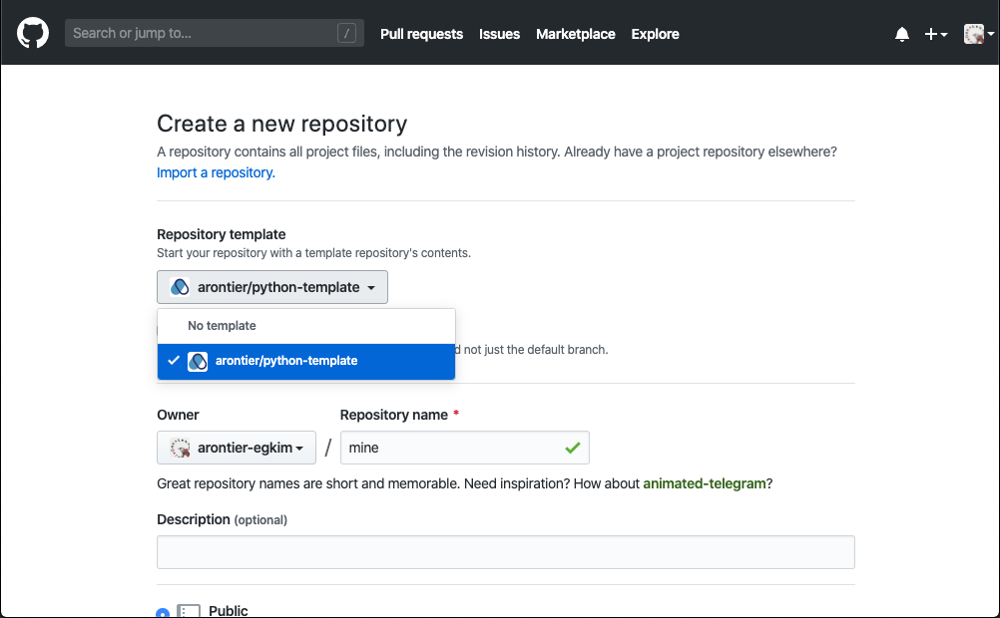

# python-template

Arontier Python package *template*, this is.

## Quickstart

When you start a new repository for a Python package,
you can use this repository as a template.
If you select this template from "Repository template"
during repository creation as shown below



GitHub will copy this repository to make yours.

Let's assume your new repository URL is `http://github.com/arontier/mine`.

After your repository is created, it contains all the files
in this template repository, including this README.
It is good time to visit your repository to read this document there.

Do *not* clone the repository.
Let's test your project as a Python package:

```bash
pip3 install git+ssh://git@github.com/arontier/mine.git
drive-yours
pip3 uninstall -y python-template
```

It should print a greeting message:

```
Hello, World!
```

If you see any error message,
you likely didn't register your SSH key to GitHub.
Register SSH key now and try the commands above again.
For more information, please read [this](https://help.github.com/en/github/authenticating-to-github/adding-a-new-ssh-key-to-your-github-account).

## Quick customization

Let's do a little bit of customization.
It won't fit to your final needs but will help you understand what you need to do later.

Git-clone your repository and change directory to `mine`:

```bash
git clone git@github.com:arontier/mine.git
cd mine
```

Let's change the module name;
change `./arontier/yours` to `./arontier/mine`.
This is where your library code lives.

Then let's change an application name;
change `./bin/drive-yours` to `./bin/drive-mine`.
Note that `./bin` can contain your applications
using your library, some test files, or anything you want really.

Open `drive-mine` and change the module name `yours` to `mine`. I.e.

```python
# from arontier.yours import hello  # old
from arontier.mine import hello     # new
```

Then open `./setup.py` and change the values of the following keyword arguments in `setup()`:

* `name`: Write your package name. Use hyphens instead of blanks or underscores. (E.g. `mine`)
* `version`: Write your package `__init__.py` location. (E.g. `arontier/mine/__init__.py`)
* `packages`: Write your package location. (E.g. `arontier/mine`)
* `description`: Write a brief description about your package.
* `url`: Write your repository URL. (E.g. `http://github.com/arontier/mine.git`)
* `author`: Write your name.
* `author_email`: Write your Arontier email address.
* `scripts`: List binaries under `bin` directory. (E.g. `bin/drive-mine`)
* `install_requires`: List Python packages which your package requires. They are used to be listed in `requirements.txt`.

And git-push the change to your remote repository:

```bash
git add .
git commit -m "Change module name to mine."
git push
```

Now install your Python package again to see if it works:

```bash
pip3 install git+ssh://git@github.com/arontier/mine.git
drive-mine
pip3 uninstall -y mine
```

If you see the greeting message again, you are ready to do coding.


## How to use

### Edit mode

You may think, should I repeat to code, install, test, and uninstall to my package?
The answer is *NO*.

After clone or pull your repository, go to the local working directory and do this:

```bash
pip3 install -e .
```

Now your package is installed in *edit* mode, which means editing your package is modifying
the installed package. They *are* the same really.

If you want to see how your package is installed, do this:

```bash
pip3 list
```

To uninstall your package `mine`, do this:

```bash
pip3 uninstall mine
```

### Library only

You don't need `bin`?
Remove `bin` directory and remove `scripts` keyword argument in `setup()` in `./setup.py`.

### Data files

You need to data files like `csv` or `json` in your package?
List files in `MANIFEST.in`.

## References

* Native namespace package: [https://packaging.python.org/guides/packaging-namespace-packages/#native-namespace-packages](https://packaging.python.org/guides/packaging-namespace-packages/#native-namespace-packages)
* [https://setuptools.readthedocs.io/en/latest/setuptools.html#new-and-changed-setup-keywords](https://setuptools.readthedocs.io/en/latest/setuptools.html#new-and-changed-setup-keywords)
